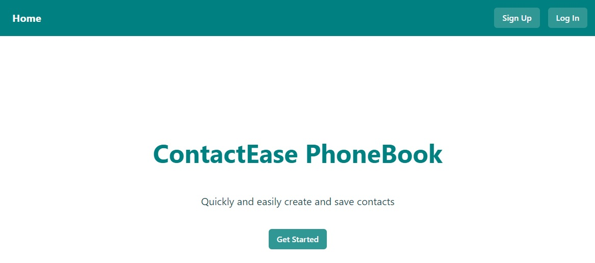
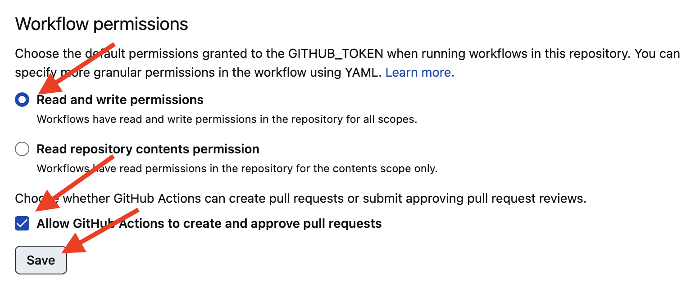

# Phonebook React App README

## Overview



This repository contains the source code for a React application named
"Phonebook." To get started, users need to register. After registration, they
gain access to a form for adding new contacts and a filter for sorting contacts
by name. Each contact has options for deletion and modification. Only registered
users have access to the contacts page. After logging out, users are redirected
to the login page. Documentation for the backend can be found
[here](https://connections-api.herokuapp.com/docs/). The project uses React,
React Router DOM, Redux Toolkit, and Chakra UI.

## Getting Started

To run the application locally, follow these steps:

1. Clone the
   repository:`git clone https://github.com/IrynaBondarenko7/phonebook.git`
2. Navigate to the project directory: `cd phonebook`
3. Install dependencies: `npm install`
4. Start the development server: `npm start`
5. Open your browser and visit `http://localhost:3000` to view the app.

## Technologies Used

- **React:** The main JavaScript library used for building the user interface.
- **React Router DOM:** Enables navigation within the React application.
- **Redux Toolkit:** State management for predictable and scalable state
  containers.
- **Chakra UI:** Component library for building accessible and customizable UI.

## Features

- **Registration:** Users need to register to access the application.
- **Contact Form:** Registered users can add new contacts using a form.
- **Contact Filter:** A filter allows users to sort contacts by name.
- **Contact Management:** Each contact has options for deletion and
  modification.
- **Authentication:** Only registered users have access to the contacts page.
- **Logout:** After logging out, users are redirected to the login page.

# React template

This project was created with
[Create React App](https://github.com/facebook/create-react-app). For
acquaintance and settings of additional features
[refer to documentation](https://facebook.github.io/create-react-app/docs/getting-started).

## Creating a repository using a template

Use this GoIT repository as a template to create a repository of your project.
To do this, click on the `“Use this template”` button and select the option
`"Create a new repository"` as shown in the image.


The next step will open the page for creating a new repository. Fill in the
field his name, make sure that the repository is public, then click the button
`"Create repository from template"`.


After the repository is created, you need to go to settings created repository
to the `Settings` > `Actions` > `General` tab as shown in the image.


Scrolling to the very end of the page, in the `“Workflow permissions”` section,
select option `"Read and write permissions"` and check the checkbox. This
necessary to automate the project deployment process.



Now you have a personal project repository, with a structure of files and
folders template repository. Then work with it as with any other personal
repository, clone it on your computer, write code, make commits and send them to
GitHub.

## Preparing for work

1. Make sure that the LTS version of Node.js is installed on your computer
   [Download and install](https://nodejs.org/en/) it if necessary.
2. Install the project dependencies in the terminal with the command
   `npm install`.
3. Start development mode by running the command `npm start`.
4. Go to the address in your browser
   [http://localhost:3000](http://localhost:3000). This page will automatically
   reload after saving changes to the project files.

## Deploy

The production version of the project will be automatically built and deployed
to GitHub Pages, to the gh-pages branch, every time the main branch is updated.
For example, after a direct push or an accepted pull request. To do this you
need in the file package.json edit the homepage field and the build script,
replacing your_username and your_repo_name to your own, and push the changes to
GitHub.

```json
"homepage": "https://your_username.github.io/your_repo_name/"
```

Next, you need to go to the GitHub repository settings (Settings > Pages) and
set the distribution of the production version of files from the /root folder of
the gh-pages branch, if this was not done automatically.


### Deployment status

The deployment status of the latest commit is displayed by an icon next to its
identifier.

- **Yellow color** - the project is being assembled and deployed.
- **Green** - deployment completed successfully.
- **Red** - an error occurred during linting, build or deployment.

e detailed information about the status can be viewed by clicking on the icon,
and in in the drop-down window, follow the `Details` link.


### Live page

After some time, usually a couple of minutes, the live page can be viewed to the
address specified in the edited `homepage` property. For example, here link to
live version for this repository
[https://goitacademy.github.io/react-homework-template](https://goitacademy.github.io/react-homework-template).

If a blank page opens, make sure there are no errors in the `Console` tab
associated with incorrect paths to CSS and JS project files (**404**). Quicker
All you have is an incorrect value for the `homepage` property in the
`package.json` file.

### Routing

If the application uses the `react-router-dom` library for routing, you need to
additionally configure the `<BrowserRouter>` component by passing in the prop
`basename` is the exact name of your repository. A slash at the beginning of a
line is required.

```jsx
<BrowserRouter basename="/your_repo_name">
  <App />
</BrowserRouter>
```

## How it works


1. After each push to the `main` branch of the GitHub repository, a special
   script (GitHub Action) from file`.github/workflows/deploy.yml`.
2. All repository files are copied to the server, where the project is
   initialized and undergoes linting and assembly before deployment.
3. If all steps were successful, the assembled production version of the project
   files goes to the `gh-pages` branch. Otherwise, in the execution log The
   script will indicate what the problem is.
